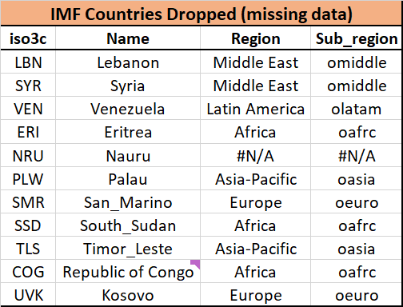

# Long-Term GDP Growth Estimation


## Model Overview

We model GDP growth following the IMF for the first five years and then best fit historical trends using a 
Hodrick-Prescott filter followed by an ARIMA to estimate trends. Detailed explanation on the modelling approach
can be found here: https://energyaspects.atlassian.net/wiki/spaces/RES/pages/1808531473/Long-Term+GDP+Growth+Estimation

### I. Inputs

* GDP constant prices (national currency) - DBnomics (IMF; WEO; .NGDP_R)
* Population - DBnomics (UNDATA; DF_UNDATA_WPP; .SP_POP_TOTL.A._T._T._T..M)
* PPP conversion rate - DBnomics (IMF; WEO; .PPPEX)
* GDP current prices (national currency) - DBnomics (IMF; WEO; .NGDP)


### II. Model parameters

We are fitting an auto-arima model, from the Pmdarima statistical library.
The auto-ARIMA process seeks to identify the most optimal parameters for an ARIMA model, settling on a single fitted ARIMA model.

`auto_arima_model = pm.auto_arima(train,
                                         start_p=1,
                                         start_q=1,
                                         start_P=1,
                                         start_Q=1,
                                         max_d=2,
                                         suppress_warnings=True,
                                         error_action='ignore',
                                         seasonal=False,
                                         stepwise=False,
                                         with_intercept=True
                                         )`

Key parameters:
* `max_d=2` - The order of first-differencing shouldn't exceed 2.
* `with_intercept=True` - Force the model to include an intercept term. This is essential to replicate EViews behaviour.
* `seasonal=False` - The data is SA-adjusted, so no seasonal adjustment is needed.
* `stepwise=False` - if True, with_intercept is reset to 'auto' to selectively change it to `False` in the presence of certain
  differencing conditions.


### III. Outputs

The model is forecasting GDP growth for all countries with a complete input dataset.
Countries with missing recent GDP values such as Venezuela are dropped - see list below.



Our GDP growth forecasts are used to derive the following macro economic variables:
* GDP per Capita (B$2017)
* Real GDP (B$2017)

All model outputs can be viewed using this SJ dashboard: 
https://energyaspects.shooju.com/#views/bvlzhmioneafxwhydmci/4d3930a11386dd2fa6a1bb17271a9754

### IV. Adjustments & Scenarios

Adjustments can be applied to the baseline GDP growth values of any given country. There
are two types of adjustments:
* Type I - apply % adjustment to a specific year i.e: +1% in 2022.
* Type II - apply % adjustment to each year from base year onwards i.e: +2% from 2025.

On top of the baseline adjustments, user defined scenarios can be created using the
same adjustment types. Output are stored in SJ under new SIDs and subsequent models can
be run using a specific scenario other than the baseline.

At the moment, adjustments should be parsed using the adjustment_template file stored in the utils folder.
A dashboard will be made available to users once finished.

## How to run 

Install requirements and run script on terminal from project root directory.

### Clone repo to local machine

`git clone git@github.com:energyaspects/long-term-gdp-model.git`

### From Terminal:
#### Install package

`python setup.py install`

#### Run script

`cd src`

`python main.py`


### Script parameters overview:

```
Optional arguments:
  -h, --help               Show this help message and exit
  --base_year BASE_YEAR    Base year for PPP (default=2017)
  --train_start_year TRAIN_START_YEAR 
                           Filter training data from date (default=1980)
  --train_end_year TRAIN_END_YEAR
                           Filter training data until date 
  --fcst_end_year FCST_END_YEAR
                           Provide forecasting horizon end year (default=2050)
  --train_model            Parse if you want to train the model before predicting
  --PROD                   Provide Shooju path to store outputs
  --model_param_path MODEL_PARAM_PATH
                           Provide path to store models
  --scenario  {baseline,scenario}
                           Select the scenario - any scenario other than baseline will require 'scenario_name' and 'adjustment.
                           (default=baseline)
  --adjustment             Parse if adjustments - update the adjustment template file in utils with adjustment values.
  --adjustment_only        Parse to apply adjustments only (use existing forecasts) (default=False)                 
  --port      PORT         (default=52162)
  --scenario_name   SCENARIO_NAME
                           Provide a meaningful scenario name i.e. 'High_growth              
``` 


